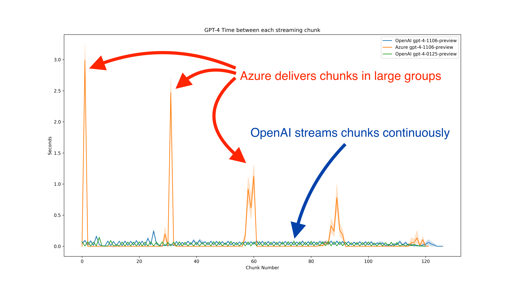
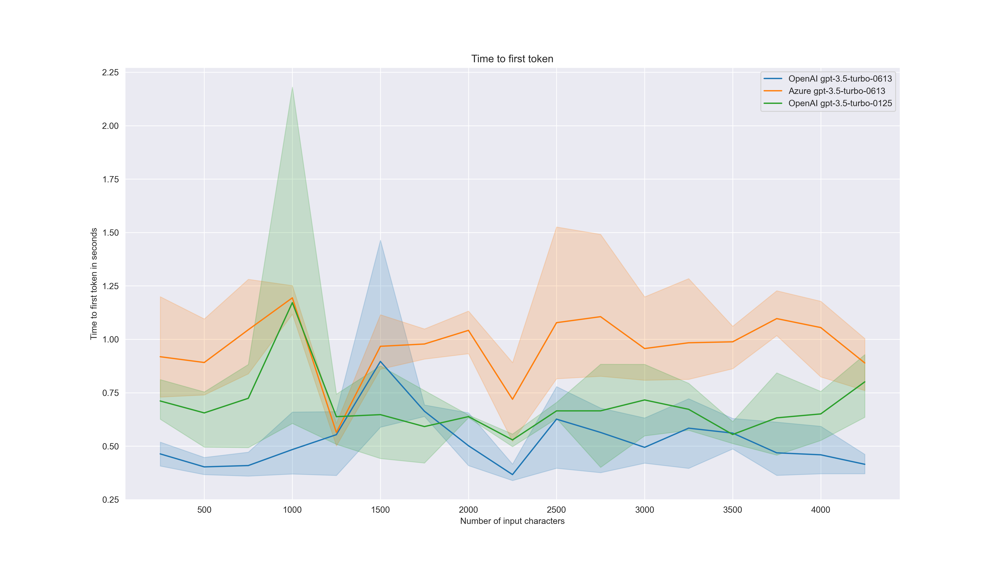
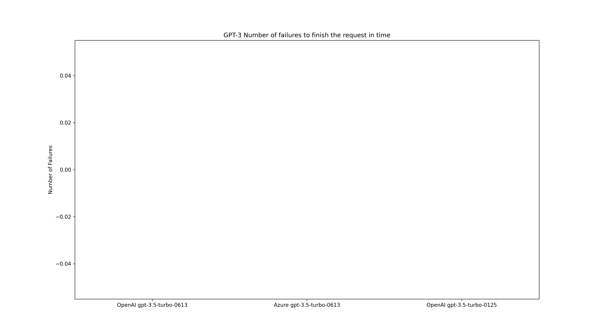

<p align="center">
  
</p>
<p align="center">
    <em>Tool to measure performance characteristics of various LLM providers</em>
</p>

---

This tool is designed to measure the time it takes to summarize [snippet](latencylab/providers/input_text.txt) from the [Wikipedia article](https://en.wikipedia.org/wiki/Bread) displayed below. 

It sends requests to LLM providers using separate threads. 
Should a request fail to complete within the allotted time, it's marked as failed. 

The tool streams the responses, evaluating various characteristics for each data chunk as well as for the entirety of the request.
```
Bread is a staple food prepared from a dough of flour (usually wheat) and water, usually by baking.
Throughout recorded history and around the world, it has been an important part of many cultures' diet.
It is one of the oldest human-made foods, having been of significance since the dawn of agriculture,
and plays an essential role in both religious rituals and secular culture.

Bread may be leavened by naturally occurring microbes (e.g. sourdough), chemicals (e.g. baking soda),
industrially produced yeast, or high-pressure aeration, which creates the gas bubbles that fluff up bread.
In many countries, commercial bread often contains additives to improve flavor, texture, color, shelf life,
nutrition, and ease of production.
```

The payload sent to the LLM is very simple and consists of only 2 messages:
```javascript
[
    {"role": "system", "content": "Summarize following text"},
    {"role": "user", "content": "Bread is a staple food prepared..."},
]
```

Values measured for each request
* Time for first chunk to arrive 
* Time for first sentence to arrive 
* Time for complete request to finish
* Time between each chunk
* Number of API timeouts

---

# Results 🏁

From the [charts](#charts) the following observations have been made. 
It's important to note that these findings are preliminary and subject to further verification and updates.

* 🥞 It appears **Azure delivers streaming chunks in batches** rather than in a continuous stream of events. 
  * This observation is based on the behavior seen with [GPT-4](misc/gpt_4_chunks_timing_line.png) and [GPT-3.5](misc/gpt_3_chunks_timing_line.png)
  * Azure usually delivers chunks in batches of 30, whereas OpenAI tends to deliver chunks more continuously.
* ❌ Regarding responsiveness, Azure's [GPT-4 **frequently fails**](misc/gpt_4_num_failures.png) to respond in time, in contrast to [GPT-3.5, which **never fails**](misc/gpt_3_num_failures.png).
* 🐌 On the aspect of speed, [**GPT-3.5 is observed to be faster**](misc/gpt_3_total_request_time_seconds_bar_median.png) than [GPT-4](misc/gpt_4_total_request_time_seconds_bar_median.png), according to the current data.
* 📝 Time to first token [seems to be constant](misc/prompt_size_vs_first_token_time_seconds_gpt_3.png), with various prompt sizes

These results are part of a continuous effort to understand and improve API performance, and feedback or additional insights are welcome.







Maximum timeout for each request was set to **30 seconds** and test was conduced between **9:00 and 13:00 UTC** from GCP instance in France.  

Results from the test run are stored in [CSV file](out.csv).

---

# Charts

All charts are generated in this [Jupyter notebook](charts.ipynb)

## Stacked time components

| GPT-3.5    | GPT-4                                                 |
|------------|-------------------------------------------------------|
|  |  |

## Time between streaming chunks

| GPT-3.5                                  | GPT-4                                    |
|------------------------------------------|------------------------------------------|
|    |    |
|   |   |
|  |  |
|         |         |


## API timeouts

| GPT-3.5                          | GPT-4                               |
|----------------------------------|-------------------------------------|
|  |     |

## API performance

| GPT-3.5                                                    | GPT-4                                                      |
|------------------------------------------------------------|------------------------------------------------------------|
|              |              |
|                |                |
|             |             |
|  |  |
|     |     |
|   |   |

# How to use this tool

## Requirements
```
git clone git@github.com:ScaleVoice/LatencyLab.git
cd LatencyLab
poetry install
poetry shell
```

To run the benchmark you will need following values

* OpenAI API key - `<openai_key>`
* Azure Secret - `<azure_key>`
* Azure API Endpoint - `<azure_endpoint>`
* Azure deployments
  * gpt-3.5-turbo-0613 - `<azure_deployment_gpt35>`
  * gpt-4-1106-preview - `<azure_deployment_gpt4_turbo>`

## CLI
```
latencylab latency all-providers --help                                                                                                                                        
                                                                                                                                                                                                           
 Usage: latencylab latency all-providers [OPTIONS] OPENAI_KEY AZURE_KEY                                                                                                                                        
                                     AZURE_ENDPOINT AZURE_DEPLOYMENT_GPT35                                                                                                                                 
                                     AZURE_DEPLOYMENT_GPT4_TURBO                                                                                                                                           
                                     OUTPUT_CSV_FILE                                                                                                                                                       
                                                                                                                                                                                                           
╭─ Arguments ─────────────────────────────────────────────────────────────────────────────────────────────────────────────────────────────────────────────────────────────────────────────────────────────╮
│ *    openai_key                       TEXT  [default: None] [required]                                                                                                                                  │
│ *    azure_key                        TEXT  [default: None] [required]                                                                                                                                  │
│ *    azure_endpoint                   TEXT  [default: None] [required]                                                                                                                                  │
│ *    azure_deployment_gpt35           TEXT  [default: None] [required]                                                                                                                                  │
│ *    azure_deployment_gpt4_turbo      TEXT  [default: None] [required]                                                                                                                                  │
│ *    output_csv_file                  PATH  [default: None] [required]                                                                                                                                  │
╰─────────────────────────────────────────────────────────────────────────────────────────────────────────────────────────────────────────────────────────────────────────────────────────────────────────╯
╭─ Options ───────────────────────────────────────────────────────────────────────────────────────────────────────────────────────────────────────────────────────────────────────────────────────────────╮
│ --sleep-interval-seconds        INTEGER  [default: 300]                                                                                                                                                 │
│ --max-test-time-seconds         INTEGER  [default: 86400]                                                                                                                                               │
│ --help                                   Show this message and exit.                                                                                                                                    │
╰─────────────────────────────────────────────────────────────────────────────────────────────────────────────────────────────────────────────────────────────────────────────────────────────────────────╯
```

Run the benchmark with following command, output will be stored in `out.csv`

```
latencylab latency all-providers \
  <openai_api_secret> \
  <azure_api_secret> \
  <azure_api_endpoint> \
  <azure_gpt_3_5_deployment> \
  <azure_gpt_4_deployment> \
  ./out.csv --max-test-time-seconds 600 --sleep-interval-seconds 15
```

# Supported LLMs

* OpenAI
  * gpt-3.5-turbo-0613
  * gpt-3.5-turbo-0125
  * gpt-4-1106-preview
  * gpt-4-0125-preview
* Azure OpenAI
  * gpt-3.5-turbo-0613
  * gpt-4-1106-preview